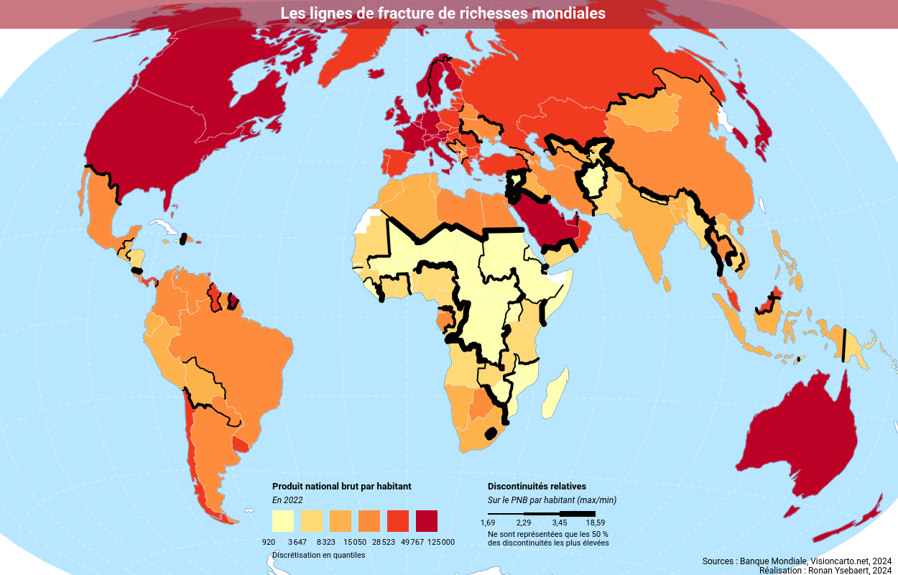
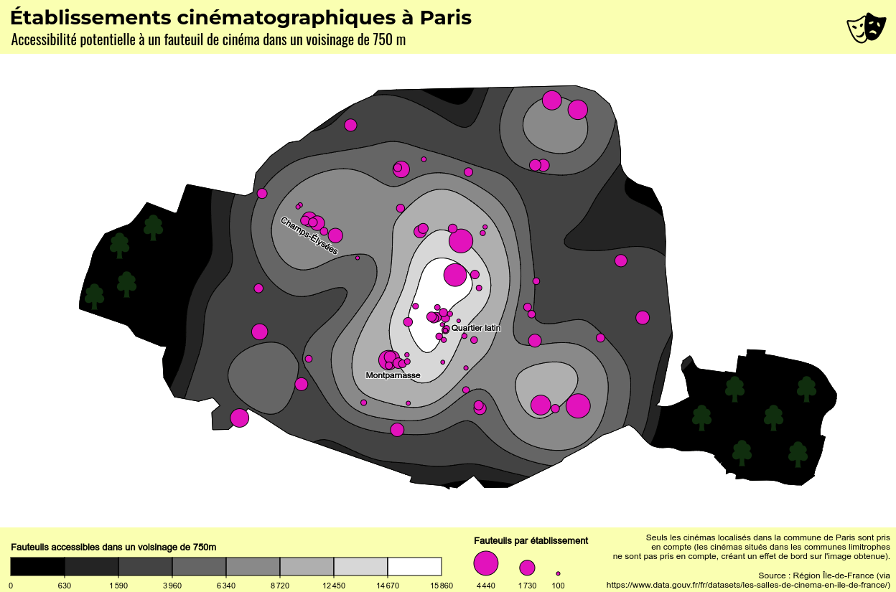

# Magrit - Thematic cartography


[en] [Magrit](https://magrit.cnrs.fr) is an online thematic mapping application developed by [UAR RIATE](https://riate.cnrs.fr/).  
[fr]  [Magrit](https://magrit.cnrs.fr) est une application de cartographie thématique développée par l'[UAR RIATE](https://riate.cnrs.fr/).


[](https://www.bestpractices.dev/projects/9208)

## Basics

- Magrit is a web application for thematic mapping (*cartography*).
- Everything happens in the browser, so **your data never leaves your computer**.
- It's intentionally simple (the UI follows the basic steps of map creation).
- It's **designed for teaching and learning cartography**.
- It lets you import **your own geometry dataset** (**Shapefile**, **GeoJSON**, **GML**, **GeoPackage**, etc.) and optionally your **tabular file** (CSV, XLSX, ODS, etc.).
- We also provide many sample datasets to try out the various representations and become familiar with the application.
- It allows you to **render and combine a wide variety of maps**: choropleth, proportional symbols, cartogram, discontinuity, smoothed maps, links, etc.
- It allows you to **customize the appearance of your maps** in various ways.
- It supports all the most popular modern desktop browsers.
- Magrit is written in modern JS and uses notably [solid.js](https://github.com/solidjs/solid) and [d3.js](https://github.com/d3/d3) libraries
  as well as various WebAssembly modules ([GDAL](https://github.com/bugra9/gdal3.js), [GEOS](https://github.com/chrispahm/geos-wasm), [Contour-wasm](https://github.com/mthh/contour-wasm), [go-cart-wasm](https://github.com/riatelab/go-cart-wasm)).

## Try it out

- Online version: [https://magrit.cnrs.fr](https://magrit.cnrs.fr)
- [Download the desktop version](https://magrit.cnrs.fr/download/)

## Examples





## Latest changes

You can find the latest changes in the Changelog file, either in the source code (in [French](./docs/changelog.md) or in [English](./docs/en/changelog.md))
or directly on the Web site ([French](https://magrit.cnrs.fr/changelog.html) or [English](https://magrit.cnrs.fr/en/changelog.html)).

Information about changes are also available in the [release notes](https://github.com/riatelab/magrit/releases) of the GitHub repository.

## Development

Requirements:

- Node.js (>= 20) / NPM (>= 10).

### Installation

```bash
npm install
```

### Running for development

```bash
npm run dev
```

The application will be available at [http://localhost:3000](http://localhost:3000). 

### Running for development, with electron

```bash
npm run dev:electron
```

A window will open with the application running.

### Building for production

```bash
npm run build
```

The application and it's documentation will be built in the `dist` directory.

### Building for production, with electron

```bash
npm run build:electron
```

The application (for Windows and GNU/Linux) will be built in the `release` directory.

## Contributing to Magrit

Contributions are welcome! There are various ways to contribute to the project which are detailed in [CONTRIBUTING](CONTRIBUTING.md) file! You can notably:

- Report bugs or send us feedback.
- Add new translations or fix existing ones.
- Contribute code (you're in the right place! Clone the repo, fix what you want to be fixed and submit a pull request - note that for all non-trivial modifications, it's best to start by opening an issue to discuss it together!).

If you want to read more about what we are planning to do, you can check the [roadmap](ROADMAP.md)
of the project.

## License

GPL-3.0-or-later
