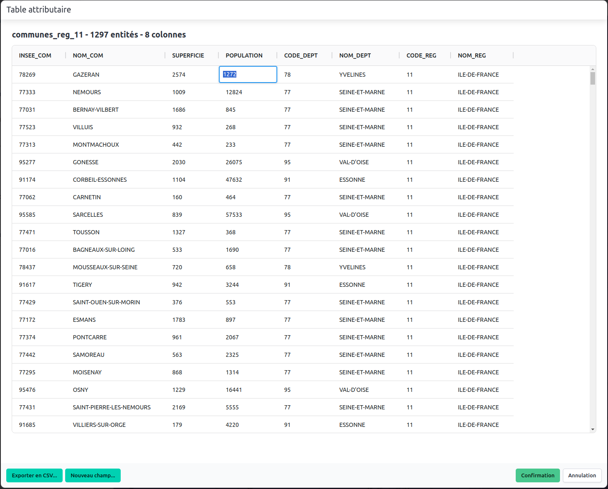

# Tableau de données

Le tableau de données est un élément central de l'interface de Magrit.
Il permet, pour chaque couche, de visualiser et de modifier ses données.

## Modification des données

La modification des données est possible en double-cliquant sur une cellule puis en rentant la valeur souhaitée.

## Export au format CSV

Il est possible d'exporter le tableau de données affiché au format CSV en cliquant sur le bouton "Exporter en CSV..." en bas à gauche du tableau.
Lors de ce type d'export, la géométrie des entités n'est pas exportée (si vous souhaitez un type d'export qui inclut la géométrie,
vous pouvez utiliser la fonctionnalité "Export" dans le menu de gauche).

## Ajout d'un nouveau champ

Il est possible d'ajouter un nouveau champ en cliquant sur le bouton "Nouveau champ..." en bas à gauche du tableau.

Cette fonctionnalité est comparable à la fonctionnalité "calculatrice de champ" des logiciels SIG comme QGIS.

Les champs actuels de la couche sont accessibles sous forme de raccourcis (boutons jaunes) ainsi que trois champs spéciaux (boutons verts) :

- `$length` : le nombre d'entités dans la couche,
- `$id` : l'identifiant unique (et interne) de l'entité,
- `$area` : l'aire de l'entité (si il s'agit d'un polygone).

Plusieurs opérations sont possibles (certains sont présentes sous forme d'un raccourci - boutons bleus) :

- les opérateurs mathématiques de base (`+`, `-`, `*`, `/`),
- des fonctions mathématiques (`sqrt`, `exp`, `abs`, `round`, `floor`, `ceil` et `power`),
- des fonctions de chaînes de caractères (`concat`, `substring`, `lower`, `upper`, `trim` et `replace`).

Afin de créer un nouveau champ, il est nécessaire de spécifier le nom du champ à créer, le type de données (stock, ratio, etc.) et la formule de calcul.
Lorsque la formule est valide, un aperçu des valeurs calculées (3 premières lignes du tableau) est affiché.

Lorsque la formule n'est pas valide, un message d'erreur est affiché et le bouton "Calculer" est désactivé.

## Suppression d'un champ

Il est possible de supprimer un champ en effectuant un clic droit sur le nom du champ (dans l'entête de colonne) puis en cliquant sur "Supprimer la colonne".

## Fermeture du tableau de données

Lors de la fermeture du tableau de données et si des modifications ont été effectuées, une popup de confirmation s'ouvre.
Il est possible de sauvegarder les modifications effectuées en cliquant sur le bouton "Confirmation" ou d'annuler les modifications en cliquant sur le bouton "Annulation".