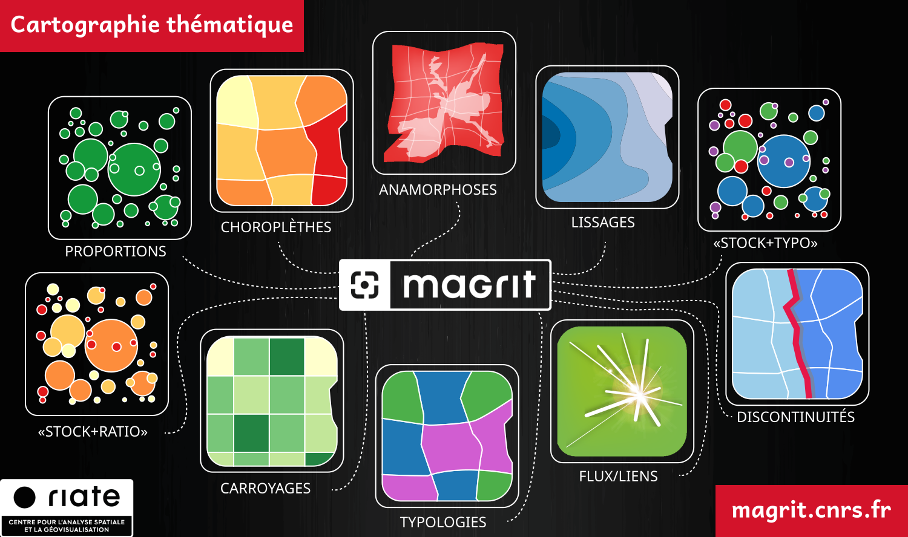

# Training materials

The [RIATE](https://riate.cnrs.fr) team provides training materials to learn the basics of thematic mapping (history of cartography,
base maps, semiology of graphics and visual variables, map design, etc.) and to learn how to use Magrit to create high-quality thematic maps.

These training materials are made available under the terms of the [Creative Commons Attribution-ShareAlike 2.0 License](http://creativecommons.org/licenses/by-sa/2.0/fr/).

These materials are currently only available in French and can be viewed at the following address: [https://magrit-formation.github.io/](https://magrit-formation.github.io/).

    

