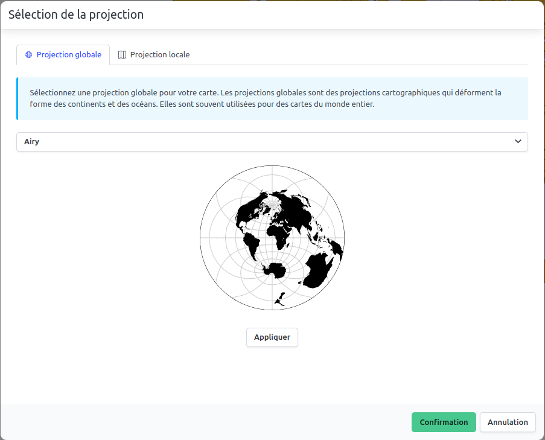

# Choix d'une projection cartographique

La projection cartographique est un élément essentiel de la cartographie.
Elle permet de représenter la surface de la Terre (que ce soit dans sa globalité ou qu'il s'agisse d'une petite portion du
territoire) sur un plan.
Il existe de nombreuses projections cartographiques, chacune ayant ses avantages et ses inconvénients.

Dans Magrit, la projection par défaut lors de l'ajout des données est la projection Natural Earth 2.

## Menu déroulant d'accès rapide aux projections

Il est possible de changer la projection de la carte dans la section "Configuration de la carte" située dans le menu de gauche : plusieurs
projections courantes sont proposées ainsi que la possibilité d'explorer toutes les projections disponibles dans Magrit.

    
    <i>Menu d'accès rapide aux projections</i>

## Personnalisation des paramètres de la projection

Lors de l'utilisation d'une projection globale, il est généralement possible de gérer plusieurs paramètres de la projection :
- son centre (sur les axes λ, φ et γ)
- son ou ses parallèle(s) standard(s)

    
    <i>Personnalisation des paramètres d'une projection (ici la projection Wagner)</i>

## Fenêtre de choix d'une projection

### Projection globale

    
    <i>Personnalisation des paramètres d'une projection (ici la projection Wagner)</i>

### Projection locale

    
    <i>Personnalisation des paramètres d'une projection (ici la projection Wagner)</i>

