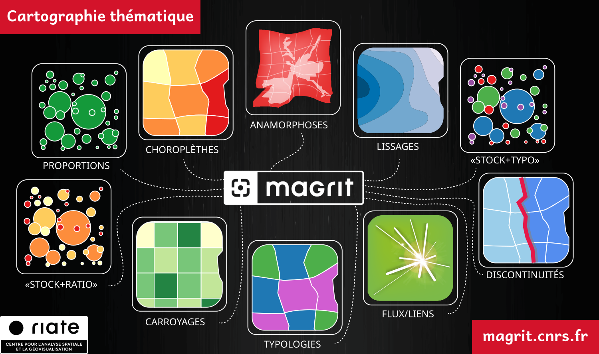

# Supports de formation

L'équipe du [RIATE](https://riate.cnrs.fr){target=_blank} met à disposition des supports de formation
pour apprendre les bases de la cartographie thématique (histoire de la cartographie, fonds de carte, sémiologie graphique
et variables visuelles, habillage et mise en page, etc.)
et pour apprendre à utiliser Magrit pour réaliser des cartes thématiques de qualité.

Ces supports de formation sont mis à disposition selon les termes de la
[Licence Creative Commons Attribution - Partage dans les Mêmes Conditions 2.0](http://creativecommons.org/licenses/by-sa/2.0/fr/){target=_blank}.

Ils sont disponibles à l'adresse suivante : [https://magrit-formation.github.io/](https://magrit-formation.github.io/){target=_blank}.

    

