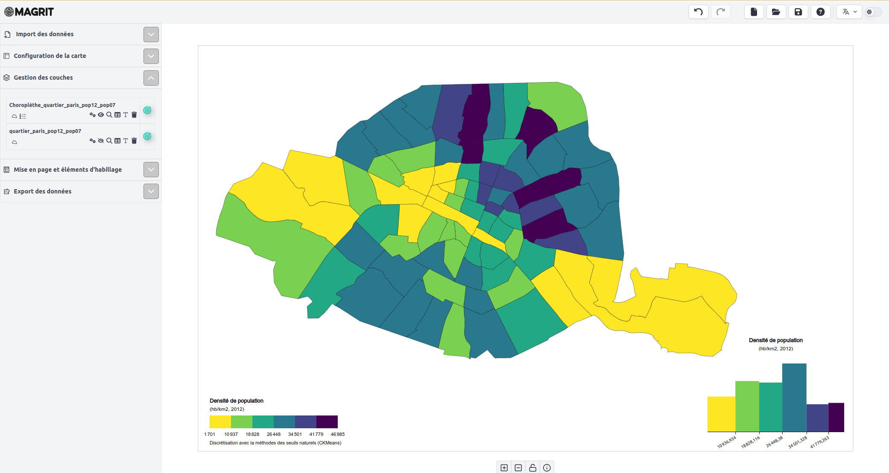

# Description de l'interface utilisateur

     
    
    <i>Vue d'ensemble de l'interface lors de la réalisation d'une carte</i>

L'interface utilisateur est divisée en trois parties principales :

- **La barre de menu** : située en haut de l'interface, elle permet d'accéder à plusieurs fonctionnalités "générales" de l'application (changement de langue, ouverture / sauvegarde d'un projet, accès à la documentation, etc.).
- **Le menu latéral gauche** : il permet de naviguer entre les différentes étapes de la réalisation d'une carte (import des données, choix d'une projection cartographique, créations des différentes représentations, export de la carte réalisée, etc.)
- **La zone centrale** : c'est ici que l'utilisateur peut visualiser sa carte et interagir avec elle.

Chaque étape de la réalisation d'une carte est représentée par un onglet dans le menu latéral gauche. L'utilisateur peut naviguer entre ces onglets pour revenir sur une étape précédente ou passer à l'étape suivante.